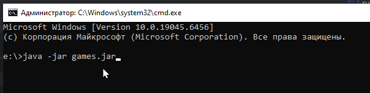
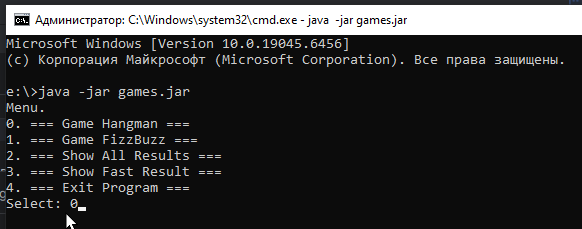
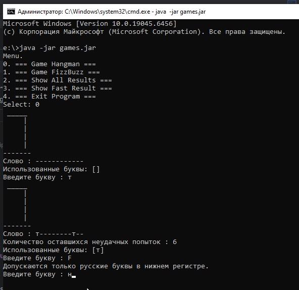
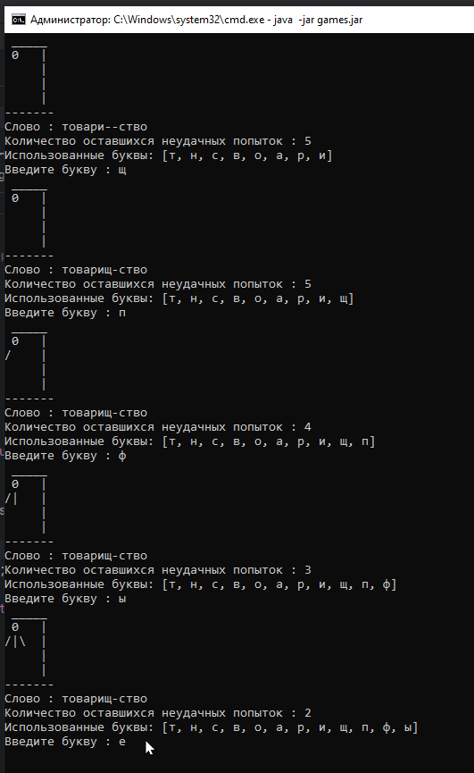
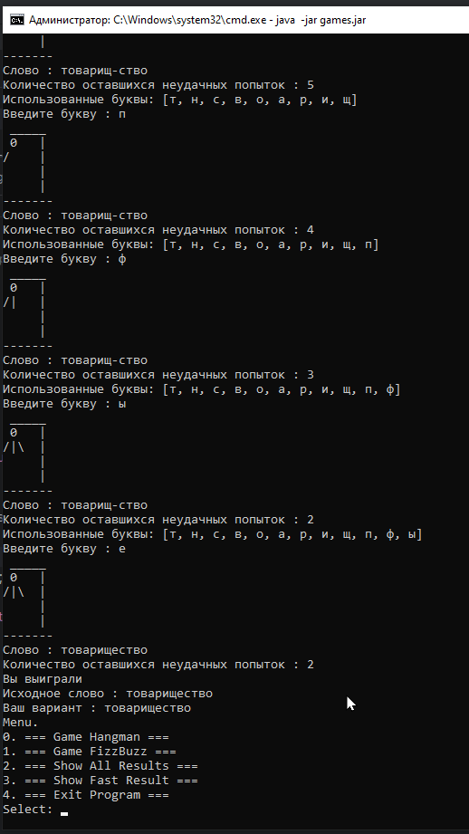

# Виселица

Проект выполнен в рамках roadmap Сергея Жукова.

Приложение можно запустить в окне командной строки Windows. Для запуска на компьютере должна быть установлена Java.
Скачайте архив games.jar, и в том же каталоге выполните команду 'java -jar games.jar' :

Архив скомпилирован для использования в командном окне Windows с кодировкой IBM866. 

Управление доступно через Меню. Выберите игру Hangman:

Программа предложит угадать слово. Допускается ввод только русских букв в нижнем регистре:

Повторный ввод ранее введенных букв не уменьшает количество оставшихся попыток. Каждая неудачная попытка добавляет к "повешенному" следующую часть тела: 

После завершения игры программа вернется в меню:

Можно запустить игру заново, посмотреть результаты игр или выбрать другую игру. Кроме Hangman доступна игра FizzBuzz.

